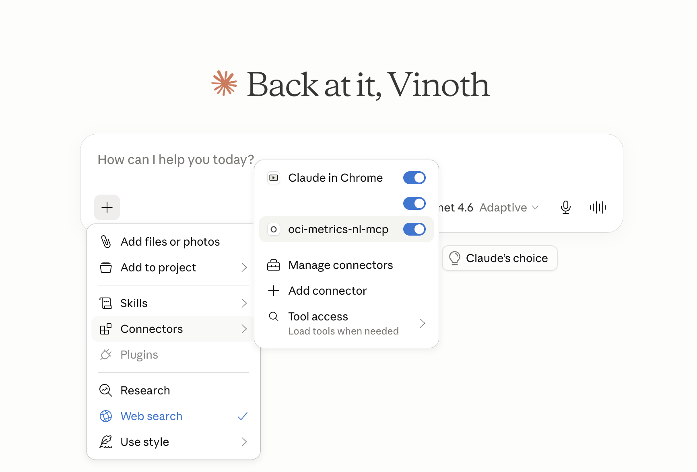
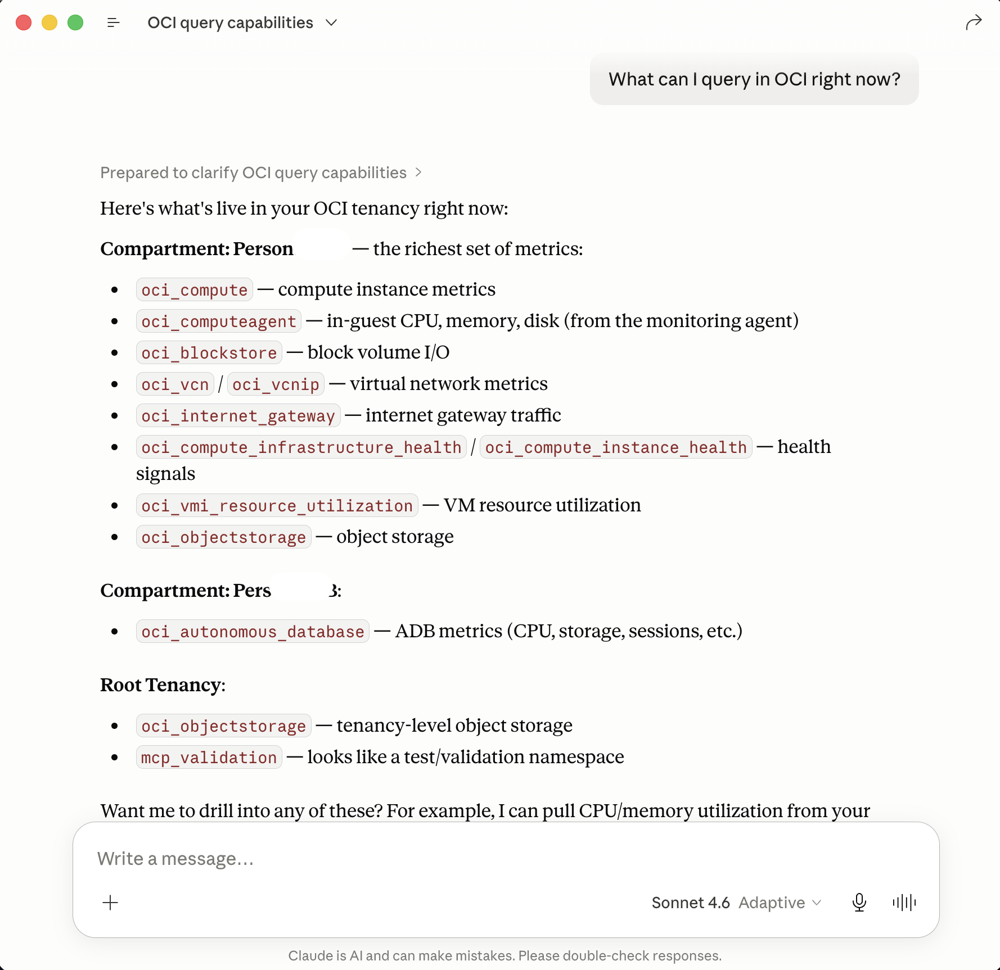
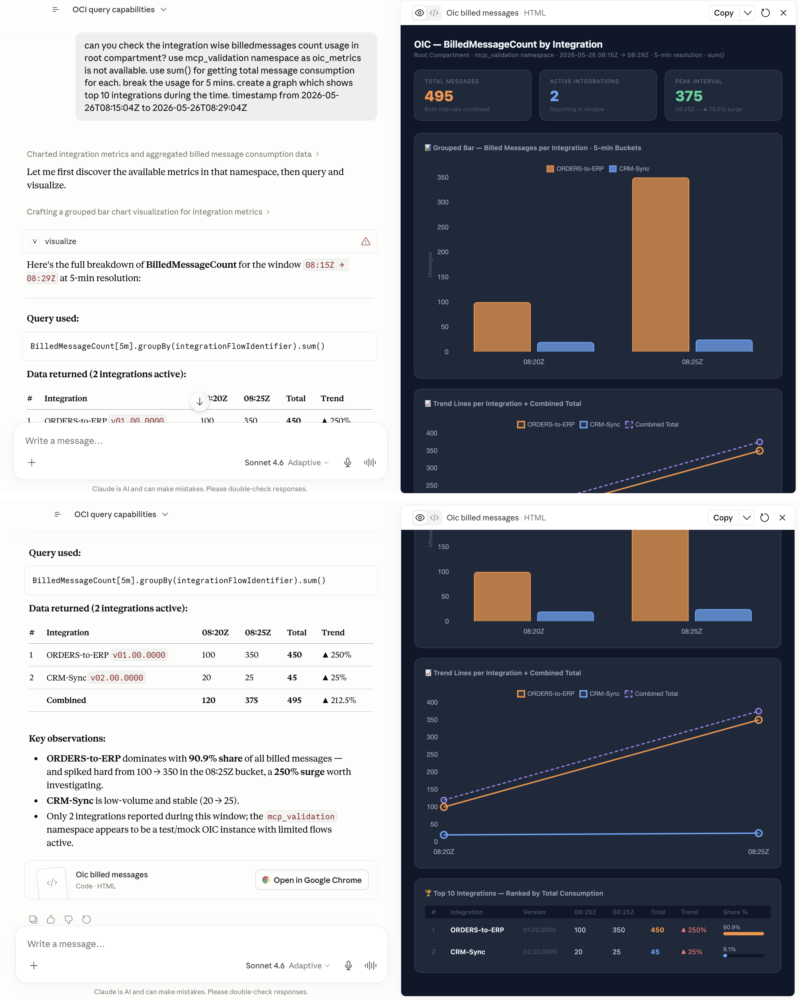

# oci-metrics-nl-mcp


**Ask questions about OCI metrics in English. Get answers in English, skip the clicks.**

An [MCP](https://modelcontextprotocol.io) server that lets Claude, and any other MCP-compatible client, query Oracle Cloud Infrastructure Monitoring metrics through natural language. Built first for Oracle Integration Cloud (OIC) — because *"which integration is burning through our message packs?"* is the question Metrics Explorer cannot answer in fewer than six clicks.

```
You:    Which integrations consumed the most message packs last week?
Claude: ORDERS-to-ERP is your biggest consumer at 4.2M (38%), up 67% w/w —
        most of it Tuesday PM. Want me to break it down by hour?
```

*Built as a learning project, with Claude Code as a coding pair — architecture, design decisions, and review by me; implementation accelerated by AI.*

---

## Contents

- [Demo](#demo)
- [Quick start](#quick-start)
- [OCI setup](#oci-setup)
- [Claude Desktop config](#claude-desktop-config)
- [Tools](#tools)
- [Try it with sample data](#try-it-with-sample-data-optional)
- [Roadmap](#roadmap)
- [Troubleshooting](#troubleshooting)
- [Contributing](#contributing)
- [Disclaimer](#disclaimer)
- [License](#license)

---

## Demo

*End to end — ask a question, get an answer and a chart:*


**1. Connected in Claude Desktop** — the server shows up under MCP servers once configured.



**2. Discover what's queryable** — *"What can I query in OCI right now?"*



**3. Ask a real question** — *"Which integration consumed the most billed messages?"* Claude writes the MQL, groups by `integrationFlowIdentifier`, ranks the results, and charts them.



---

## Quick start

### Prerequisites

- Python 3.11–3.13
- [uv](https://docs.astral.sh/uv/getting-started/installation/)
- An OCI account with `~/.oci/config` set up (see [OCI setup](#oci-setup) below)

### Install

```bash
git clone https://github.com/vinothkumr/oci-metrics-nl-mcp.git
cd oci-metrics-nl-mcp
uv sync
```

---

## OCI setup

**1. Install the OCI CLI** (macOS / Linux one-liner; [full install docs](https://docs.oracle.com/en-us/iaas/Content/API/SDKDocs/cliinstall.htm)):

```bash
bash -c "$(curl -L https://raw.githubusercontent.com/oracle/oci-cli/master/scripts/install/install.sh)"
```

**2. Set up an API-key user.** This MCP server authenticates as an OCI user via an API signing key. In the OCI Console, create (or pick) a user, then generate an API key and write `~/.oci/config`:

```bash
oci setup config
```

`oci setup config` prompts for your user OCID, tenancy OCID, and region, generates a key pair, and writes the `DEFAULT` profile. Then upload the generated public key to your user: **Console → Identity → Users → your user → API keys → Add API key → Paste public key**. Details: [API signing key & user setup](https://docs.oracle.com/en-us/iaas/Content/API/Concepts/apisigningkey.htm).

**3. Grant IAM policies.** This server is **read-only** — it lists compartments and reads metric data, nothing more. Add a policy (Console → Identity → Policies) for the group your user belongs to. Replace the group name with yours:

```
Allow group 'OracleIdentityCloudService'/'OCI_Analytics_UG' to inspect compartments in tenancy
Allow group 'OracleIdentityCloudService'/'OCI_Analytics_UG' to read metrics in tenancy
```

`inspect compartments` lets it discover compartments; `read metrics` covers both `ListMetrics` and `SummarizeMetricsData`. You can scope `in tenancy` down to `in compartment <name>` to restrict it. ([Monitoring policy reference](https://docs.oracle.com/en-us/iaas/Content/Identity/Reference/monitoringpolicyreference.htm).)

> **Cost:** the server only reads built-in `oci_*` metric namespaces (e.g. `oci_integration`), which are **free** in OCI Monitoring and don't count toward ingestion. This is OCI Monitoring, not Logging Analytics — different service, different billing. ([Monitoring pricing](https://www.oracle.com/devops/monitoring/pricing/).)

---

## Claude Desktop config

Add the server under `mcpServers` in your Claude Desktop config file:

- **macOS:** `~/Library/Application Support/Claude/claude_desktop_config.json`
- **Windows:** `%APPDATA%\Claude\claude_desktop_config.json`

```json
{
  "mcpServers": {
    "oci-metrics-nl-mcp": {
      "command": "uv",
      "args": [
        "--directory",
        "/ABSOLUTE/PATH/TO/oci-metrics-nl-mcp",
        "run",
        "oci-metrics-nl-mcp"
      ]
    }
  }
}
```

Replace `/ABSOLUTE/PATH/TO/oci-metrics-nl-mcp` with the actual path on your machine (on Windows, use a full path like `C:\\Users\\you\\oci-metrics-nl-mcp`).

The tenancy OCID is read automatically from the `tenancy` field in `~/.oci/config`. No extra env vars needed for a standard setup.

Restart Claude Desktop, then ask:

> What can I query in OCI right now?

Claude will call `list_observable_resources` and return your compartments and active metric namespaces.

### Optional env vars

| Variable | Default | Purpose |
|---|---|---|
| `OCI_TENANCY_OCID` | from `~/.oci/config` | Override the tenancy OCID |
| `OCI_PROFILE` | `DEFAULT` | Profile name in `~/.oci/config` |
| `OCI_REGION` | from config | Override the region |

---

## Tools

The server exposes four read-only tools. They're designed to be chained — discover what exists, then query it.

| Tool | Arguments | Returns |
|---|---|---|
| `list_observable_resources` | — | every accessible compartment and the metric namespaces active in each |
| `list_metric_names` | `compartment_id`, `namespace` | the metric names in that namespace (e.g. `oci_integration` → `BilledMessageCount`, `MessagesSuccessfulCount`) |
| `list_metric_dimensions` | `compartment_id`, `namespace`, `metric_name` | each dimension key mapped to its observed values (e.g. `integrationFlowIdentifier` → `["ORDERS-to-ERP!01.00.0000", ...]`) |
| `query_metrics` | `compartment_id`, `namespace`, `query` (MQL), `start_time`, `end_time`, `resolution?`, `include_datapoints?` | one summarized stream per dimension combination — `min`/`max`/`mean`/`last`/`count`; raw datapoints only when `include_datapoints=true` |

### Querying with MQL

`query_metrics` takes a raw [Monitoring Query Language](https://docs.oracle.com/en-us/iaas/Content/Monitoring/Reference/mql.htm) string of the form `MetricName[interval].statistic()`. Times are ISO-8601 UTC. Examples:

```
# Mean CPU per hour
CpuUtilization[1h].mean()

# Total billed messages, broken out per integration
BilledMessageCount[1h].groupBy(integrationFlowIdentifier).sum()

# One integration only
BilledMessageCount[1h]{flowCode = "ORDERS-to-ERP"}.sum()
```

By default each stream is summarized to keep responses small (a 1-minute query over 7 days is ~10k points per stream). Set `include_datapoints=true` only after narrowing with dimension filters.

### Oracle Integration (OIC) per-integration metrics

The headline use case — *"which integration consumed the most message packs?"* — works by grouping `BilledMessageCount` on the `integrationFlowIdentifier` dimension.

> ⚠️ **Dependency:** per-integration dimensions (`flowCode`, `flowVersion`, `integrationFlowIdentifier`) only appear in the `oci_integration` namespace when the OIC instance's **aggregate-metrics flag is OFF**. With it ON, OCI Monitoring carries instance-level rollups only (dimensioned by `resourceId`), and per-integration breakdown is not available.

---

## Try it with sample data (optional)

No Oracle Integration instance? `scripts/load_sample_data.py` posts two fake, OIC-shaped integrations so you can exercise the tools end to end.

**1. Grant write permission (temporary).** Posting metrics needs `METRIC_WRITE`, which the read-only server policy does **not** include. Add this for your user's group while loading, then remove it:

```
Allow group 'OracleIdentityCloudService'/'OCI_Analytics_UG' to use metrics in tenancy
```

(`use metrics` ⊇ `read metrics`, so it temporarily supersedes the read-only line.)

**2. Run the loader** from the project root:

```bash
uv run python scripts/load_sample_data.py
```

It posts to a **custom `mcp_validation` namespace** — not `oci_integration`. OCI reserves the `oci_*` prefix for built-in service metrics, so you cannot post into it; sample data must live in a custom namespace. The metric and dimension *names* match real OIC; only the namespace differs.

**3. Query it back** (wait ~1–2 min for ingestion). The script prints the exact time range; then in Claude or the Inspector:

```
namespace : mcp_validation
BilledMessageCount[1m].groupBy(integrationFlowIdentifier).sum()
# expect: ORDERS-to-ERP!01.00.0000 = 550, CRM-Sync!02.00.0000 = 50
```

> **Cost:** the loader posts ~40 custom datapoints — far within OCI Monitoring's free tier (first 500M datapoints/month). Custom metrics, unlike built-in `oci_*` ones, do count toward ingestion, but this volume is negligible.

---

## Roadmap

### v0.1 — shipped
- `list_observable_resources` — discover compartments and active metric namespaces

### v0.2 — shipped (current)
- `list_metric_names`, `list_metric_dimensions` — drill into a namespace
- `query_metrics` — run MQL queries, summarized by default

### v0.3 — next
- Alarm read tools (`list_alarms`, `get_alarm_history`)
- Write tools with a propose/confirm pattern (`create_alarm`)
- Canned intent tools (`find_top_consumers`, …) — only if the LLM struggles to compose them from the primitives above

### Later
- Synthetic data generator for testing without a live tenancy
- CI and multi-Python-version coverage

---

## Troubleshooting

| Symptom | Cause / fix |
|---|---|
| `403` / `NotAuthorizedOrNotFound` on a tool call | The user is missing IAM permissions. Confirm the `read metrics` and `inspect compartments` policies from [OCI setup](#oci-setup) are applied to your user's group. |
| Some compartments come back with an empty `namespaces` list | Expected — the server silently skips compartments where you lack metric-read permission. Grant `read metrics` in those compartments if you need them. |
| `query_metrics` returns an error mentioning resolution or range | OCI enforces per-interval limits (1m→7d, 5m→30d, 1h→90d). Use a coarser interval in your MQL (e.g. `[1h]` instead of `[1m]`) or shorten the time range. |
| MCP Inspector: `PORT IS IN USE` (6274 / 6277) | A previous Inspector session is still running. `lsof -ti :6274 :6277 \| xargs kill -9`, then restart. |
| Empty result with no error | No data for that metric/time range. Widen the range, or verify the metric exists via `list_metric_names`. |

---

## Contributing

This is a personal learning project. Issues and suggestions are welcome; PRs may not be merged, but I'll read them.

---

## Disclaimer

This software is provided **"as is"**, without warranty of any kind, express or implied. The author is not liable for any claim, damages, or other liability arising from its use. You are responsible for what you do with it — including any IAM permissions you grant and any costs incurred in your OCI tenancy.

Not affiliated with, endorsed by, or supported by Oracle Corporation. Built independently using the public OCI SDK and Monitoring APIs.

---

## License

Apache 2.0 — see [LICENSE](LICENSE).
